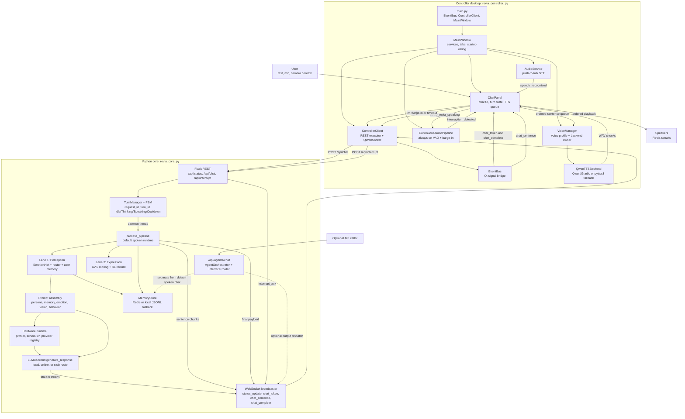
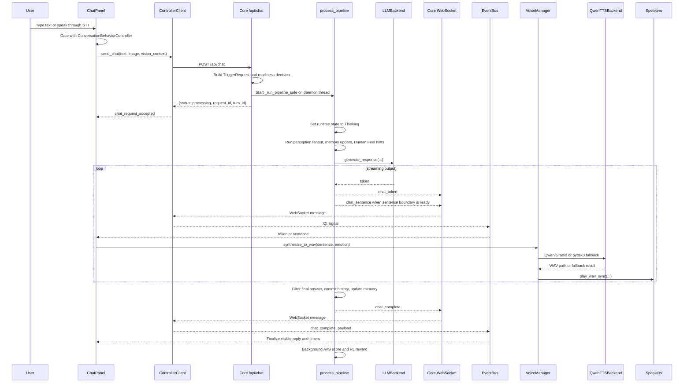
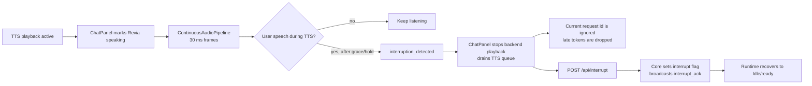
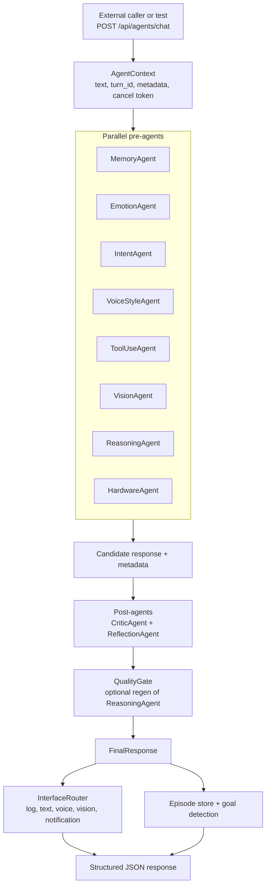

# REVIA How It Works Diagram

Snapshot from the current checkout on 2026-05-14.

## Current Runtime Truth

- `revia_controller_py/` is the desktop controller UI.
- `revia_core_py/` is the main runtime backend.
- REST defaults to `http://127.0.0.1:8123`.
- WebSocket defaults to `ws://127.0.0.1:8124`.
- The normal spoken chat path uses `/api/chat`.
- `/api/agents/chat` is an additive parallel-agent endpoint. It is not the default `ChatPanel` spoken path.
- `revia_core_cpp/` is present as an experimental secondary core, but visible replies still run through the Python path.

## Main System Map

## Normal Spoken Turn

## Interrupt And Barge-In

## Parallel-Agent Endpoint

## Ownership Summary

| Area | Owner |
| --- | --- |
| Visible desktop app | `revia_controller_py/gui/main_window.py` |
| Chat turn UI, streaming render, TTS sentence queue, interrupts | `revia_controller_py/gui/widgets/chat_panel.py` |
| REST and WebSocket client bridge | `revia_controller_py/app/controller_client.py` |
| Push-to-talk STT | `revia_controller_py/app/audio_service.py` |
| Continuous VAD and barge-in detection | `revia_controller_py/app/continuous_audio.py` |
| Voice profile and TTS backend ownership | `revia_controller_py/app/voice_manager.py` |
| Qwen/Gradio and pyttsx3 speech backend | `revia_controller_py/app/tts_backend.py` |
| REST, WebSocket, normal chat endpoint, runtime orchestration | `revia_core_py/core_server.py` |
| Conversation state and behavior gates | `revia_core_py/conversation_runtime.py` |
| Turn/request lifecycle | `revia_core_py/runtime_models.py` |
| Persona normalization and prompt assembly | `revia_core_py/persona_manager.py`, `revia_core_py/profile_engine.py`, `revia_core_py/prompt_assembly.py` |
| Hardware detection, scheduling, provider fallback | `revia_core_py/runtime/` |
| Optional parallel agents and output interfaces | `revia_core_py/agents/`, `revia_core_py/interfaces/` |

## Key Takeaway

The default experience is not a single blocking call. The controller posts a chat request, the core returns an immediate request id, generation continues in a background pipeline, and tokens/sentence chunks stream back over WebSocket. The UI speaks sentence chunks as they arrive, while final filtering, memory commits, quality scoring, and reward updates happen around or after the visible response.
