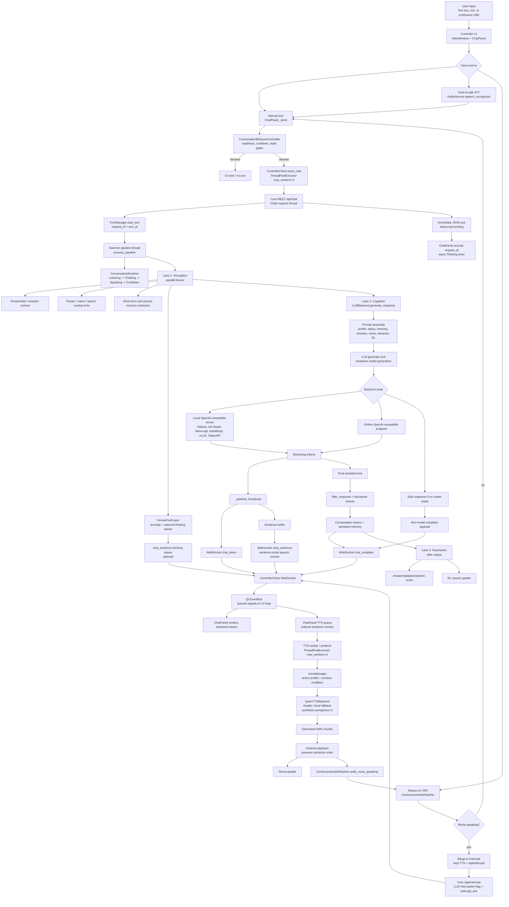
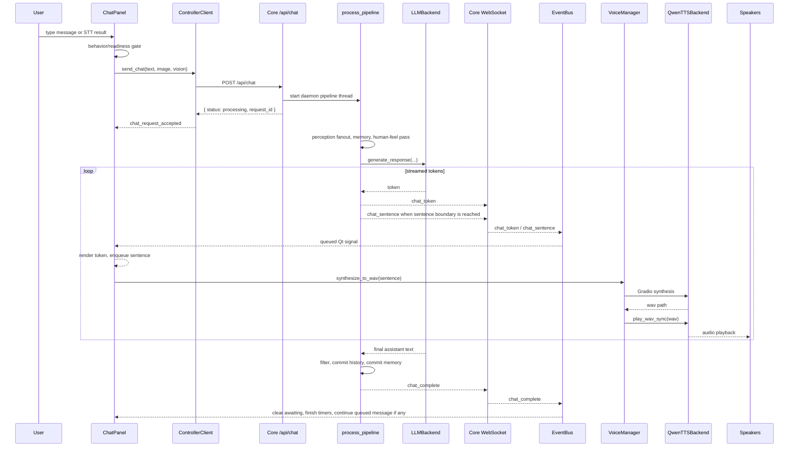
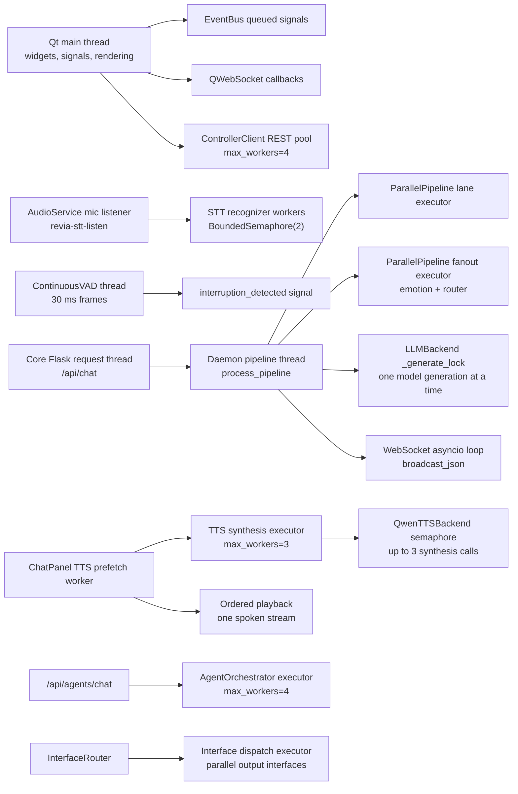
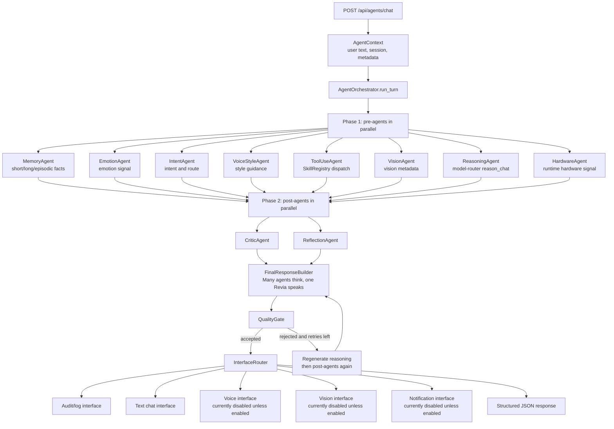
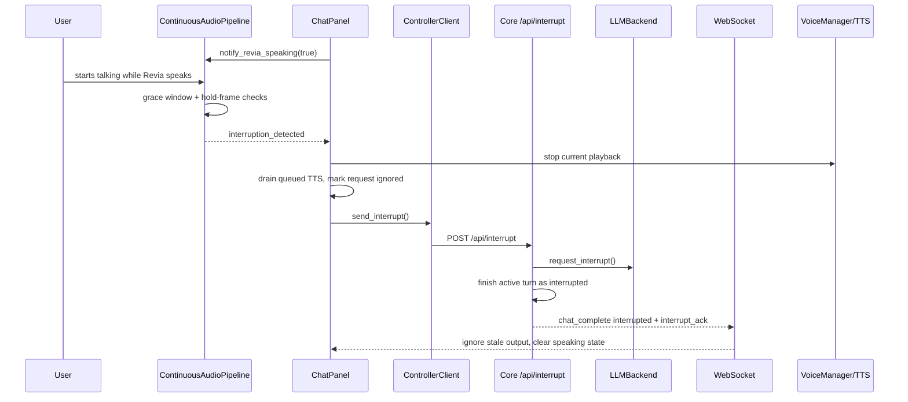

# REVIA Input-to-Speech Deep Dive

This document describes the current runtime path in this checkout, from a user typing or speaking to Revia generating text, streaming partial speech, playing audio, and handling interruptions.

## Current runtime truth

- The primary user-to-speech path is the Python controller (`revia_controller_py`) talking to the Python core server (`revia_core_py`) over REST on port `8123` and WebSocket on port `8124`.
- The normal chat UI sends to `/api/chat`. It does not currently use `/api/agents/chat`.
- `/api/agents/chat` is an additive parallel-agent endpoint with its own orchestrator and interface router. It is important architecture, but it is not the default ChatPanel path.
- The C++ spine (`revia_core_cpp`) is additive behind feature flags and HTTP bridges. It is not the current main chat-to-speech path.
- `VoiceManager` is the controller-side owner for TTS. Qwen/Gradio is the primary backend when ready, with local fallback behavior.

## End-to-end diagram

## Streaming sequence

## Thread and executor map

## Main components

### Controller UI

`MainWindow` builds the controller services and wires the chat surface, audio service, continuous VAD, voice tab, behavior controller, status manager, and runtime state sync.

`ChatPanel` owns the visible chat turn. It:

- accepts typed text and STT results;
- gates turns through `ConversationBehaviorController`;
- sends REST chat requests through `ControllerClient`;
- renders `chat_token` streaming output;
- converts `chat_sentence` chunks into a sentence-level TTS queue;
- tracks Thinking, Generating, TTS Gen, and Speaking timing;
- interrupts current output when the user barge-ins or sends another message.

`ControllerClient` keeps the UI responsive by using a small REST executor and a WebSocket push path. `/api/chat` returns quickly with `request_id`; the actual answer arrives over WebSocket as `chat_token`, `chat_sentence`, and `chat_complete`.

`EventBus` is the Qt signal bridge. It lets REST worker threads, WebSocket callbacks, and service threads safely hand updates back to the UI loop.

### Speech input and interruption

There are two speech-related paths:

- `AudioService` handles push-to-talk or explicit mic listening. It records audio, runs speech recognition in background work, and emits `speech_recognized`.
- `ContinuousAudioPipeline` is always-on VAD. It watches 30 ms frames and emits `interruption_detected` only when Revia is currently marked as speaking and the user's speech passes the grace and hold thresholds.

When barge-in fires, `ChatPanel` drains pending TTS chunks, stops backend playback if possible, posts `/api/interrupt`, and ignores stale streamed output for the interrupted request.

### Core `/api/chat` path

The core chat endpoint does not wait for generation. It:

1. Builds a response trigger and checks behavior/readiness gates.
2. Starts a `TurnManager` turn and creates a `request_id`.
3. Starts `process_pipeline` on a daemon thread.
4. Returns `{ status: "processing", request_id, turn_id }`.

`process_pipeline` is the main runtime path:

1. Moves the runtime state through thinking/generating/speaking/cooldown.
2. Runs Lane 1 perception fanout for emotion and routing hints.
3. Adds user memory and extracts person facts.
4. Adds Human Feel prosody and optional thinking-pause output.
5. Calls Lane 2 cognition through `LLMBackend.generate_response`.
6. Streams tokens over WebSocket as they arrive.
7. Buffers sentence chunks and emits `chat_sentence` for low-latency TTS.
8. Filters the final answer, commits conversation history, and saves assistant memory.
9. Broadcasts `chat_complete`.
10. Runs Lane 3 expression work after output, including AVS scoring and RL reward update.

### Prompt construction

`LLMBackend._build_messages` assembles the model input from:

- active character profile;
- runtime status;
- short-term and long-term memory context;
- emotion context;
- optional vision/image context;
- behavior parameters from the profile engine;
- reinforcement-learning behavior parameters;
- human-feel prosody instructions;
- recent conversation history.

The generation lock in `LLMBackend` serializes model generation. Revia can accept a new turn and interrupt a current one, but only one LLM generation is active inside this backend at a time.

### TTS and speaking

The core does not synthesize audio. It streams text and sentence chunks to the controller. The controller speaks.

`ChatPanel` receives `chat_sentence` and pushes each sentence into an ordered TTS queue. The TTS worker can pre-synthesize multiple upcoming chunks with `ThreadPoolExecutor(max_workers=3)`, while still playing the finished WAV chunks in sentence order.

`VoiceManager` owns the selected voice profile and emotion modifiers. `QwenTTSBackend` owns the Gradio/Qwen connection, readiness checks, endpoint selection, WAV generation, playback, and fallback speech. Its synthesis semaphore allows up to three synthesis calls at once, but playback remains ordered so Revia does not speak chunks out of sequence.

During playback, `ChatPanel` calls `ContinuousAudioPipeline.notify_revia_speaking(True)`. That is what lets the VAD distinguish normal listening from barge-in detection.

## Parallel functions and agents

### ParallelPipeline in `/api/chat`

`ParallelPipeline` provides named lanes:

- `perception`: emotion, routing, memory-adjacent signal gathering;
- `cognition`: LLM generation;
- `expression`: answer validation, reward updates, and output-adjacent work.

The current `/api/chat` pipeline uses real parallel fanout inside Lane 1 for independent perception jobs. It then waits for that result before moving into cognition, because the prompt should include emotion, memory, routing, and human-feel context.

Cognition is submitted through the lane executor, but the pipeline waits on its future while streaming tokens. This means LLM decode is asynchronous relative to the REST request and UI, but the turn logic itself still waits for the model result before final commit.

Expression work runs after `chat_complete` is prepared, so scoring and reward updates do not block the user from seeing or hearing the answer.

### `/api/agents/chat` additive endpoint

The parallel-agent system is separate from the normal ChatPanel path.

The orchestrator runs pre-agents concurrently with a four-worker executor and per-agent timeouts. It then runs post-agents concurrently, builds one final response, applies a quality gate, and may do a limited reasoning-only regeneration loop.

Important current limitation: this endpoint returns structured JSON and dispatches to configured interfaces. It does not drive the current ChatPanel streaming token/TTS path, and it does not mutate the normal `conversation_manager` history path.

## What happens on interrupt

## Notes and caveats

- The normal chat path is streaming and sentence-TTS capable; the additive agent endpoint is not currently the path the GUI uses for spoken chat.
- `LLMBackend` serializes generations with `_generate_lock`. This is deliberate protection around backend calls, but it means true multi-turn parallel model generation is not active in the normal path.
- TTS synthesis is parallelized, but playback is intentionally ordered.
- `ToolUseAgent` can dispatch skills inside the additive agent endpoint, but in the current orchestrator shape it should be verified before assuming its result is injected into the same prompt used by `ReasoningAgent`.
- The Qwen/Gradio TTS backend discovers usable endpoints from the live server. Runtime checks such as `/gradio_api/info` matter before assuming a specific TTS route exists.
- The C++ EventBus/StateManager bridge is useful migration infrastructure, but the current user-input-to-Revia-speaking path is still Python controller plus Python core.

